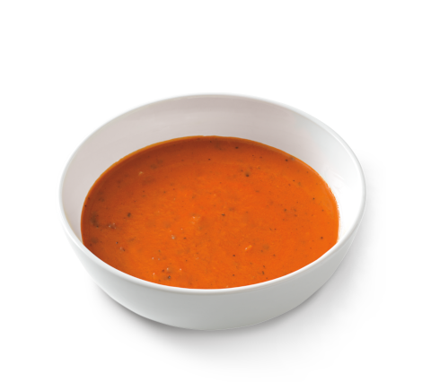

---
#
# By default, content added below the "---" mark will appear in the home page
# between the top bar and the list of recent posts.
# To change the home page layout, edit the _layouts/home.html file.
# See: https://jekyllrb.com/docs/themes/#overriding-theme-defaults
#
permalink: /
layout: home
title: "Welcome to Soupbowl's Speakeasy."
list_title: Home
---

## Latest posts:
